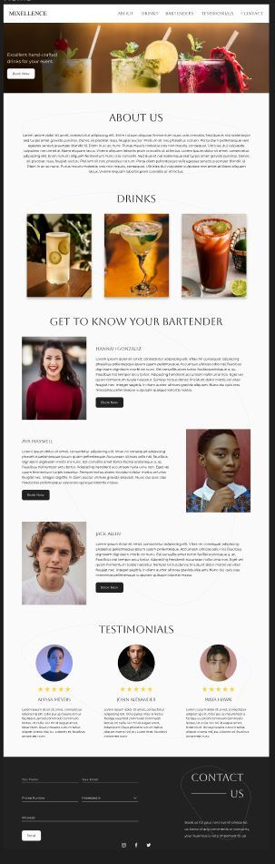

### Project Title

# MIXELLENCE

Mixellence is the brand name and logo of the company. Mixellence provides quality/excellent services.  

We used React.js for this project for the pure purpose of practicing React.  

We worked with UX designers to develop this website for the client.

[Checkout a hosted version here](https://github.io/mixellence/)

### Table of contents

 [Authors](#authors)

 [Designer] (#designer)

 [Overview](#overview)

  - [Screenshot](#screenshot)
  - [Link](#link)
  - [The Task / Challenge](#the-challenge)
  
 [The process](#the-process)

  - [Built with](#built-with)
  - [What we learned](#what-we-learned)

## Authors 

Mike Villa

- [Website](https://)
- [Linkedin](https://)

Tesfaye Robelle

- [Website](https://github.com/tdebella)
- [Linkedin](https://www.linkedin.com/in/tesfaye-robelle-4a2b7921a/)

## Designer

Jacob Difede

- [Website](https://)
- [Linkedin](https://https://www.linkedin.com/in/jacob-difede-434955221/)

## Overview

### Screenshot

  

- [figma design] https://www.figma.com/file/14NZAHE5GBa9xXvVRI05AA/Mixellence-(Devs)?node-id=2%3A5

## The Task / Challenge

- In 30 days with a group of two create a single-page react application, consisting 4 pages (client/home & admin/dashboard).

- Stretch Goals:

   - [x] Create store with redux/toolkit
   - [x] Create backend and authentication with Firebase
   - [x] Add data and user to mock database with Firebase

## Link

   - Live Site URL: [Mixellence](https://mixellence-67ae5.web.app/)

## The process

- We discussed and decided early on that we were going to create the repository and all packages necessary to build the site.  

- We used redux/redux toolkits to build the store and Firebase for the backend and authentication.   

- This is a web app built using

   - HTML5
   - CSS3
   - Module CSS
   - CSS Flexbox
   - [Styled Components](https://styled-components.com/)
   - [React](https://reactjs.org/) - JS library
   - [React Router v6.3](https://reactrouter.com/)
   - [Redux](https://redux.js.org/) & [Redux Toolkit](https://redux-toolkit.js.org/)
   - Firebase (https://console.firebase.google.com/)

- Lessons learned:
   - We met the designer & looked at the design together. We  had enough time to ask questions and discuss the functions of certain features. 
   - Working with a good designer can be a great experience. We took the opportunity to learn some new tools (e.g., figma) and client’s requirements.
   - We learnt how to collaborate & use the git/github.com (code push/pull, resolved merge conflict, etc...) while building the project in a team. 
